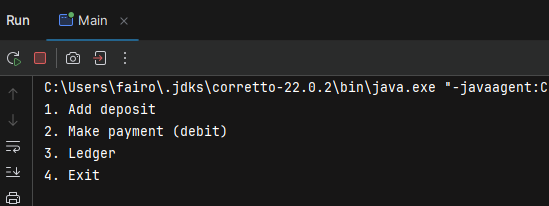
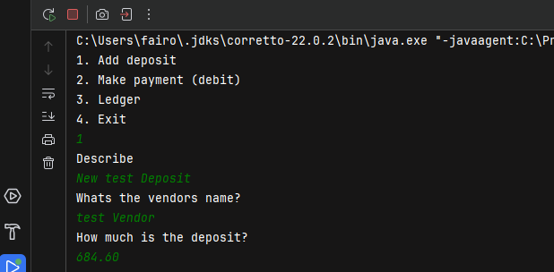
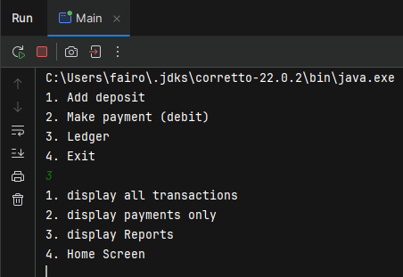
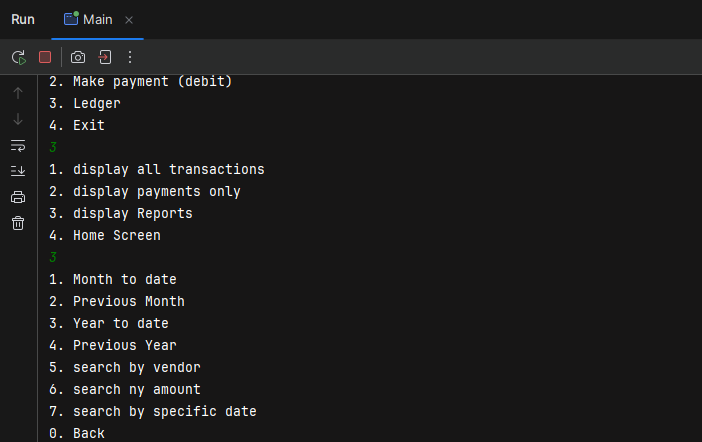

# Accounting Ledger - Capstone One
### Project Description:
    Accounting Ledger is the first java project I have built to test my skills in java
       after one month of learning it. 
    Accounting Ledger has the ability to display a company's transactions, add a new deposit or payment
       and also display or search based on a sepcific attribute the user is looking for.
Now we will view the main screens of this project.

## Home Screen

## Deposit/Payment 

## Ledger Menu

## Reports Menu

